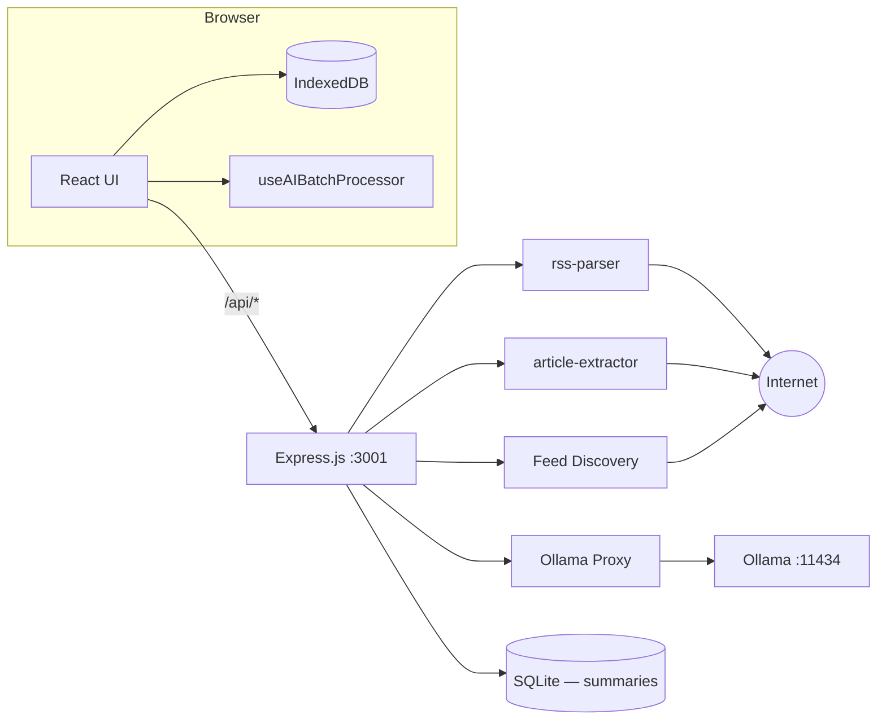

# Atlas Pulse — RSS Feed Reader Walkthrough

## What Was Built

A fully functional, privacy-first RSS feed reader running entirely locally at zero cost. Built with React + Vite frontend, Express.js backend, IndexedDB for persistent article/feed storage, SQLite for saved AI summaries, and optional Ollama integration for local AI features (summaries, content analysis, article chat, background batch processing).

---

## Architecture



**Zero cost** — No cloud services, API keys, or subscriptions. All data and AI inference stay on your machine.

---

## Features

### Feed Discovery & Adding
- **URL auto-discovery**: Paste any website URL → auto-detects RSS/Atom feeds from `<link>` tags and common paths
- **Direct RSS URL**: Paste RSS feed URLs directly
- **Google News search**: Type a keyword to subscribe to a live Google News RSS feed
- **Popular feeds catalog**: Curated feeds across Technology, AI, Business, Science, Design, News
- **OPML import/export**: Move your feeds to/from any other RSS reader

### Three-Panel Layout
- **Sidebar**: Navigation (All Articles, Today, Saved, AI Summaries Library), folder tree with feeds, unread badges
- **Article List**: Grid / List / Compact view modes; AI filter pills; batch trigger button
- **Article Reader**: Clean typography, reading progress bar, toolbar, zen/focus mode

### Article Views
| View | Description |
|------|-------------|
| **Grid** | Portrait thumbnail cards in a responsive multi-column grid |
| **List** | Title + excerpt + thumbnail rows |
| **Compact** | Dense single-line rows with source, time, and AI badge column |

### In-App Article Reader
- RSS content rendered immediately on open
- **Auto full-text extraction** — pulls clean content from the original page automatically
- **Reading progress bar** — accent-colored bar at the top tracks scroll position
- **Zen / Focus mode** — press `f` to expand reader to full width
- DOMPurify sanitization for safe HTML rendering

### Organization
- **Folders**: Create/rename/delete; right-click context menu; move feeds into folders
- **Bookmarks**: Bookmark any article; find them under "Saved" in the sidebar
- **Today view**: Shows only articles published today
- **Search**: AND-logic tokenized search — "cloud AI" matches both terms anywhere; `"quoted phrase"` for exact match; results ranked by relevance (title › source › AI topics › body)
- **Mark all read**: One-click button in the article list header
- **AI Only filter**: Toggle to show only AI-analyzed articles
- **Content filters**: Per-dimension dropdown pills (Sentiment · Urgency · Frame · Tone · Depth)

### Appearance
- **Dark / Light theme**: Toggle in sidebar header or settings
- **Collapsible sidebar**: Three states — expanded → icon-only (56 px) → fully hidden
- **Resizable panels**: Drag the handle between article list and reader
- **Font picker**: Inter, Poppins, Lato, Nunito, Merriweather, Garamond, Times, Mono, System UI
- **Accent color**: 6 presets + full custom color picker
- **Text color**: 4 presets (Cool, Warm, Pure, Soft) + full custom color picker
- **Reader typography**: Adjustable font size, line width, line height

### AI Features (requires Ollama)
- **Guided Ollama setup wizard**: Detects install status, starts Ollama, and pulls models — no terminal needed
- **AI Summary**: On-demand 3–4 sentence summary, streamed in real time
- **Content Analysis**: 5-dimension classification — Sentiment, Urgency, Frame, Tone, Depth + topic tags
- **Article Chat**: Ask any question about the article; streamed responses
- **Background batch processing**: Automatically summarizes and classifies new articles after each feed refresh
- **On-demand batch trigger**: `✨` button in the article list header queues the latest N articles immediately
- **AI processing indicator**: Spinner + remaining count in header while batch is running
- **AI Summaries Library**: Save summaries to a persistent SQLite library; search, browse, export as CSV
- **Model selector**: Live dropdown populated from your installed Ollama models
- **AI processed badge**: Sparkle indicator on analyzed articles in all three list views

### Multi-Article AI Actions
- **Multi-select**: Checkbox on any article card; floating action bar appears when ≥1 selected
- **Compare Sources** (2–5 articles): AI analysis across angle, framing, key claims, omissions, tone, evidence
- **Generate Newsletter** (3–15 articles): Daily Digest, Weekly Roundup, or Executive Brief
- **AI Briefing** (2–15 articles): Free-form prompt answered using selected articles as context
- **Streaming output**: All operations stream token by token
- **Active config strip**: Shows active AI personas, tone, and custom instructions before generating
- **Export**: Copy · Markdown (`.md`) · Word (`.docx`) · Email

### Feed Quality
- **Cross-feed deduplication**: Wire stories appearing in multiple feeds are stored only once; canonical URL normalization strips tracking params, `www.` prefix, fragments (DB v6)

---

## How to Run

```bash
cd "/Users/vinaychaganti/Documents/RSS Feed Reader"
npm install   # first time only
npm run dev
```

Open **http://localhost:5173**. This starts both the Vite frontend (`:5173`) and Express backend (`:3001`) concurrently.

---

## File Map

### Backend
| File | Purpose |
|---|---|
| [server/index.js](server/index.js) | Express server entry — mounts all routes |
| [server/routes/feeds.js](server/routes/feeds.js) | `POST /api/feeds/parse` — parse RSS URL |
| [server/routes/discover.js](server/routes/discover.js) | `POST /api/discover` — auto-discover feeds |
| [server/routes/articles.js](server/routes/articles.js) | `POST /api/articles/extract` — full article extraction |
| [server/routes/ai.js](server/routes/ai.js) | `GET /api/ai/models` · `POST /api/ai/chat` — Ollama proxy |
| [server/routes/ollama.js](server/routes/ollama.js) | `GET /api/ollama/status` · `POST /api/ollama/start\|pull` |
| [server/routes/summaries.js](server/routes/summaries.js) | CRUD + export for saved AI summaries (SQLite) |
| [server/utils/feedParser.js](server/utils/feedParser.js) | RSS/Atom parsing (rss-parser) |
| [server/utils/feedDiscovery.js](server/utils/feedDiscovery.js) | HTML link tag + common path discovery |
| [server/utils/articleExtractor.js](server/utils/articleExtractor.js) | Full text extraction |

### Frontend
| File | Purpose |
|---|---|
| [src/db/database.js](src/db/database.js) | Dexie.js IndexedDB schema v6 — feeds, articles (`canonicalLink`, `aiStatus`, `aiSummary`, `aiAnalysis`), folders |
| [src/utils/api.js](src/utils/api.js) | HTTP client — all `/api/*` calls + `streamChat()` generator |
| [src/utils/batchSettings.js](src/utils/batchSettings.js) | Batch processor config (localStorage) |
| [src/utils/helpers.js](src/utils/helpers.js) | Date formatting, read time, HTML stripping, `canonicalizeUrl` |
| [src/utils/aiSettings.js](src/utils/aiSettings.js) | AI persona + tone configuration, `buildSystemPrompt` |
| [src/utils/constants.js](src/utils/constants.js) | Auto-refresh options, popular feeds catalog |
| [src/utils/opml.js](src/utils/opml.js) | OPML import/export |
| [src/utils/docx.js](src/utils/docx.js) | Client-side Markdown → `.docx` export |
| [src/hooks/useFeeds.js](src/hooks/useFeeds.js) | Feed CRUD + refresh — cross-feed dedup by `canonicalLink`, queues articles for batch |
| [src/hooks/useFolders.js](src/hooks/useFolders.js) | Folder management |
| [src/hooks/useAIBatchProcessor.js](src/hooks/useAIBatchProcessor.js) | Background AI engine — queue watcher, processOne loop, triggerBatch |
| [src/components/Sidebar.jsx](src/components/Sidebar.jsx) | Left panel — nav, folders, feeds, library badge |
| [src/components/ArticleList.jsx](src/components/ArticleList.jsx) | Middle panel — grid/list/compact, multi-select, AI filters, batch trigger |
| [src/components/MultiArticlePanel.jsx](src/components/MultiArticlePanel.jsx) | Multi-article AI panel — Compare / Newsletter / Briefing with streaming output and export |
| [src/components/ArticleReader.jsx](src/components/ArticleReader.jsx) | Right panel — reader, toolbar, progress bar |
| [src/components/AIDrawer.jsx](src/components/AIDrawer.jsx) | AI panel — Summary / Analysis / Chat tabs |
| [src/components/OllamaSetup.jsx](src/components/OllamaSetup.jsx) | Guided Ollama install/start/model-pull wizard |
| [src/components/LibraryView.jsx](src/components/LibraryView.jsx) | Full-panel saved summaries library |
| [src/components/AddFeedModal.jsx](src/components/AddFeedModal.jsx) | Add feeds via URL / search / popular |
| [src/components/SettingsPanel.jsx](src/components/SettingsPanel.jsx) | Appearance, Reading, AI Processing, Data settings |
| [src/components/ReaderSettings.jsx](src/components/ReaderSettings.jsx) | Inline reader typography controls |
| [src/components/ResizableHandle.jsx](src/components/ResizableHandle.jsx) | Draggable panel resize handle |
| [src/App.jsx](src/App.jsx) | Root — state, layout, auto-refresh, batch wiring |
| [src/index.css](src/index.css) | Full design system (themes, typography, all components) |
| [src/main.jsx](src/main.jsx) | React entry point |

---

## Keyboard Shortcuts

| Key | Action |
|-----|--------|
| `j` / `↓` / `→` | Next article |
| `k` / `↑` / `←` | Previous article |
| `b` | Toggle bookmark |
| `o` | Open article in original tab |
| `f` | Toggle zen / focus mode |
| `/` | Focus search box |
| `Esc` | Clear selection · clear search · exit zen mode · close reader |

---

## Data Storage

| Data | Where |
|------|-------|
| Feeds, articles, folders, bookmarks, read state | IndexedDB (browser-local, via Dexie.js) |
| AI batch settings, view preferences | `localStorage` |
| Manually saved AI summaries | SQLite file (server-side, local) |

All data stays on your machine — nothing is ever sent to an external server, including AI queries.
