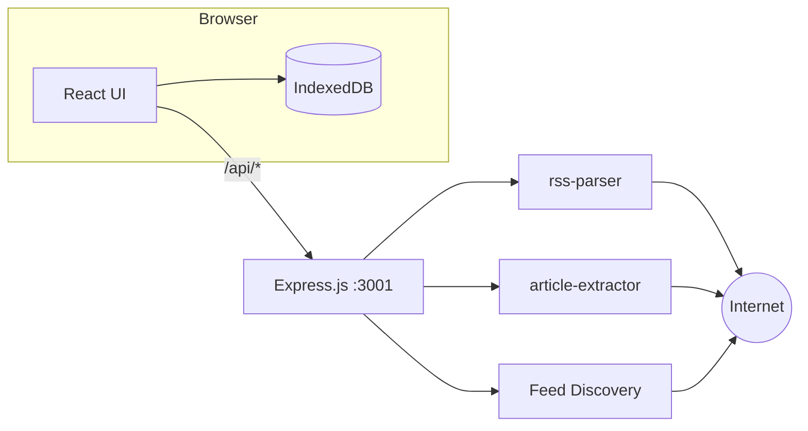

# FeedFlow — RSS Feed Reader Walkthrough

## What Was Built

A fully functional, Feedly-like RSS feed reader app running entirely locally at zero cost. Built with React + Vite frontend, Express.js backend, and IndexedDB for persistent storage.

## Demo


## Screenshots

````carousel

<!-- slide -->

<!-- slide -->

````

---

## Architecture



**Zero cost** — No cloud services, databases, or subscriptions. Everything runs on your machine.

---

## Features Implemented

### ✅ Feed Discovery & Adding
- **URL auto-discovery**: Paste any website URL → auto-detects RSS/Atom feeds
- **Direct RSS URL**: Paste RSS feed URLs directly
- **Popular feeds**: Curated categories (Tech, AI, Business, Science, Design, News)
- **Google Alerts**: Step-by-step guide + direct URL input
- **Folder assignment**: Choose which folder to add feeds to

### ✅ Three-Panel Layout
- **Sidebar**: Navigation (All Articles, Today, Saved), folder tree with feeds, unread badges
- **Article List**: Chronological feed with source labels, time-ago, preview text
- **Article Reader**: Clean typography, metadata bar, action toolbar

### ✅ In-App Article Reader
- RSS content rendered by default
- **"Load Full Article"** extracts complete article from the original page
- **"Open Original"** opens in a new tab as fallback
- Reading time estimation
- DOMPurify sanitization for safe HTML rendering

### ✅ Read/Unread & Bookmarks
- Auto-marks articles as read when opened
- Manual toggle for read/unread state
- Bookmark articles to the "Saved" collection
- Unread count badges on feeds, folders, and navigation

### ✅ Feed Management
- Create/rename/delete folders (right-click context menu)
- Remove feeds (right-click context menu)
- Cascading delete (removing a feed deletes its articles)
- Folder deletion moves feeds to uncategorized

### ✅ Feed Refresh
- Manual "Refresh All" button
- Auto-refresh every 30 minutes while app is open
- Only adds new articles (deduplication by GUID)

### ✅ Dark/Light Theme
- Dark mode by default
- Toggle via sidebar sun/moon icon
- Preference persisted in localStorage

### ✅ Settings
- Theme toggle
- Clear all data (danger zone)

---

## Files Created/Modified

### Backend (6 files)
| File | Purpose |
|---|---|
| [server/index.js](file:///Users/vinaychaganti/Documents/RSS%20Feed%20Reader/server/index.js) | Express server entry |
| [server/routes/feeds.js](file:///Users/vinaychaganti/Documents/RSS%20Feed%20Reader/server/routes/feeds.js) | Parse & refresh feed endpoints |
| [server/routes/discover.js](file:///Users/vinaychaganti/Documents/RSS%20Feed%20Reader/server/routes/discover.js) | Feed discovery endpoint |
| [server/routes/articles.js](file:///Users/vinaychaganti/Documents/RSS%20Feed%20Reader/server/routes/articles.js) | Article extraction endpoint |
| [server/utils/feedParser.js](file:///Users/vinaychaganti/Documents/RSS%20Feed%20Reader/server/utils/feedParser.js) | RSS/Atom parsing with media extraction |
| [server/utils/feedDiscovery.js](file:///Users/vinaychaganti/Documents/RSS%20Feed%20Reader/server/utils/feedDiscovery.js) | Auto-discover feeds from URLs |
| [server/utils/articleExtractor.js](file:///Users/vinaychaganti/Documents/RSS%20Feed%20Reader/server/utils/articleExtractor.js) | Full article content extraction |

### Frontend (15 files)
| File | Purpose |
|---|---|
| [src/db/database.js](file:///Users/vinaychaganti/Documents/RSS%20Feed%20Reader/src/db/database.js) | Dexie.js IndexedDB schema |
| [src/utils/api.js](file:///Users/vinaychaganti/Documents/RSS%20Feed%20Reader/src/utils/api.js) | Backend API client |
| [src/utils/helpers.js](file:///Users/vinaychaganti/Documents/RSS%20Feed%20Reader/src/utils/helpers.js) | Date, text, URL utilities |
| [src/utils/constants.js](file:///Users/vinaychaganti/Documents/RSS%20Feed%20Reader/src/utils/constants.js) | Popular feeds & app constants |
| [src/hooks/useFeeds.js](file:///Users/vinaychaganti/Documents/RSS%20Feed%20Reader/src/hooks/useFeeds.js) | Feed CRUD hook |
| [src/hooks/useArticles.js](file:///Users/vinaychaganti/Documents/RSS%20Feed%20Reader/src/hooks/useArticles.js) | Article queries hook |
| [src/hooks/useFolders.js](file:///Users/vinaychaganti/Documents/RSS%20Feed%20Reader/src/hooks/useFolders.js) | Folder management hook |
| [src/components/Sidebar.jsx](file:///Users/vinaychaganti/Documents/RSS%20Feed%20Reader/src/components/Sidebar.jsx) | Navigation sidebar |
| [src/components/ArticleList.jsx](file:///Users/vinaychaganti/Documents/RSS%20Feed%20Reader/src/components/ArticleList.jsx) | Article list panel |
| [src/components/ArticleReader.jsx](file:///Users/vinaychaganti/Documents/RSS%20Feed%20Reader/src/components/ArticleReader.jsx) | Article reader panel |
| [src/components/AddFeedModal.jsx](file:///Users/vinaychaganti/Documents/RSS%20Feed%20Reader/src/components/AddFeedModal.jsx) | Add feed modal |
| [src/components/SettingsPanel.jsx](file:///Users/vinaychaganti/Documents/RSS%20Feed%20Reader/src/components/SettingsPanel.jsx) | Settings modal |
| [src/App.jsx](file:///Users/vinaychaganti/Documents/RSS%20Feed%20Reader/src/App.jsx) | Root component |
| [src/index.css](file:///Users/vinaychaganti/Documents/RSS%20Feed%20Reader/src/index.css) | Full design system |
| [src/main.jsx](file:///Users/vinaychaganti/Documents/RSS%20Feed%20Reader/src/main.jsx) | React entry point |

### Config (3 files)
| File | Purpose |
|---|---|
| [package.json](file:///Users/vinaychaganti/Documents/RSS%20Feed%20Reader/package.json) | Dependencies & scripts |
| [vite.config.js](file:///Users/vinaychaganti/Documents/RSS%20Feed%20Reader/vite.config.js) | Vite + API proxy config |
| [index.html](file:///Users/vinaychaganti/Documents/RSS%20Feed%20Reader/index.html) | HTML entry with SEO meta |

---

## How to Run

```bash
cd "/Users/vinaychaganti/Documents/RSS Feed Reader"
npm run dev
```

This starts both the Vite frontend (`:5173`) and Express backend (`:3001`) concurrently.

---

## Validation Results

| Test | Result |
|---|---|
| Feed adding (Hacker News) | ✅ 30 articles loaded |
| Article selection & reading | ✅ Clean reader, auto mark-as-read |
| Full article extraction | ✅ Complete content rendered in-app |
| Unread count tracking | ✅ Badges update reactively |
| Add Content modal | ✅ Three tabs (Discover, Popular, Google Alerts) |
| View switching (All/Today/Saved) | ✅ Filters work correctly |
| Dark theme | ✅ Premium dark design by default |

---

## Future AI Integration

The Express backend is ready for AI endpoints:
- **Article summarization** → New route calling Ollama/local LLM
- **Topic clustering** → Embed articles, cluster in IndexedDB
- **Smart daily digest** → Scheduled server task generating briefings
- **Sentiment analysis** → Pipeline step after extraction
